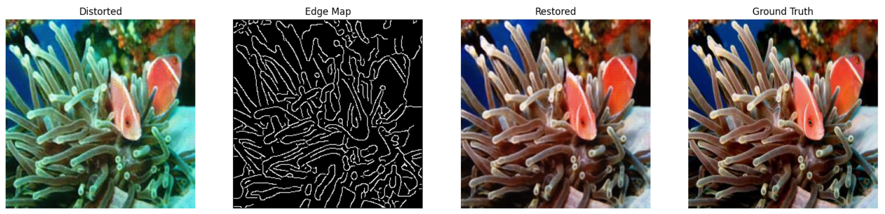

# Underwater Image Restoration with Deformable Convolutional GANs

This repository contains the implementation of an enhanced Generative Adversarial Network (GAN) for underwater image restoration, featuring deformable convolutions, a multi-scale discriminator, and an edge-aware loss function. Trained on the EUVP dataset (~11,436 paired images), the model achieves a peak PSNR of 27.07 dB and SSIM of 0.8222 after 38 epochs, demonstrating significant improvements in clarity and color fidelity for underwater images.

## Features
- **Generator**: Integrates `DeformConv2d` blocks, residual layers, and an attention module to adaptively address underwater distortions.
- **Discriminator**: Multi-scale architecture ensures realism across resolutions.
- **Loss Function**: Combines content (L1), adversarial (BCE), perceptual (MSE), and edge (L1 on Canny edges) losses.
- **Dataset**: Utilizes the full EUVP dataset for comprehensive training.

## Results
- **Quantitative**:
  - Peak PSNR: 27.07 dB (Epoch 29)
  - Peak SSIM: 0.8222 (Epoch 37)
  - After 38 epochs: PSNR: 22.92 dB, SSIM: 0.7942
- **Qualitative**: Enhanced detail and color restoration (see visualization section).

## Prerequisites
- Python 3.8+
- PyTorch 1.12.1+cu113
- Torchvision 0.13.1+cu113
- Additional libraries: `numpy`, `matplotlib`, `opencv-python`, `scikit-image`, `torchmetrics`, `tqdm`

## Setup

### 1. Clone the Repository
```bash
git clone https://github.com/yourusername/underwater-gan.git
cd underwater-gan
```

### 2. Create Environment
Using Conda:
```bash
conda create -n underwater_gan_new python=3.8
conda activate underwater_gan_new
```

### 3. Install Dependencies
```bash
pip install torch==1.12.1+cu113 torchvision==0.13.1+cu113 -f https://download.pytorch.org/whl/torch_stable.html
pip install numpy matplotlib opencv-python scikit-image torchmetrics tqdm
```

### 4. Download EUVP Dataset
- Download the EUVP dataset from [official source](https://github.com/xahidbuffon/EUVP-Dataset).
- Extract to `EUVP/Paired/` in the repository root, ensuring subdirectories like `underwater_dark/trainA`, `underwater_dark/trainB`, etc.

## Usage

### Jupyter Notebook
The implementation is in a Jupyter notebook (`underwater_gan.ipynb`). To run:

1. **Launch Jupyter**:
   ```bash
   jupyter notebook
   ```
2. **Open Notebook**: Select `underwater_gan.ipynb`.
3. **Run Cells**:
   - **Cell 1**: Imports and dependency check.
   - **Cell 2**: Edge map function.
   - **Cell 3**: Generator definition.
   - **Cell 4**: Discriminator definition.
   - **Cell 5**: Loss functions.
   - **Cell 6**: Dataset loading (update paths if needed).
   - **Cell 7**: Training loop.
   - **Cell 8**: Visualization.

### Training
Update Cell 6 with your EUVP path:
```python
dataset = EUVPDataset(r'path/to/EUVP/Paired', transform=transform)
train_loader = DataLoader(dataset, batch_size=4, shuffle=True)
```
Run Cell 7 to train (e.g., 50 epochs). Models are saved as `generator_epoch_X.pth` and `discriminator_epoch_X.pth`.

#### Training Progress (Sample)
- **Epoch 1**: PSNR: 12.81, SSIM: 0.1186, G Loss: 0.4316
- **Epoch 15**: PSNR: 26.52, SSIM: 0.7736, G Loss: 0.0748
- **Epoch 29**: PSNR: 27.07, SSIM: 0.7912, G Loss: 0.0704
- **Epoch 38**: PSNR: 22.92, SSIM: 0.7942, G Loss: 0.0898
- Full log in `underwater_gan.ipynb` or below.

### Visualization
Load a trained model and run Cell 8:
```python
generator.load_state_dict(torch.load("generator_epoch_29.pth"))  # Peak PSNR
# Run Cell 8
```
Example outputs plot with distorted, edge map, restored, and ground truth images.



## Project Structure
```
underwater-gan/
├── underwater_gan.ipynb  # Main implementation
├── EUVP/                 # Dataset directory (user-provided)
│   └── Paired/
│       ├── underwater_dark/
│       └── ...
├── generator_epoch_X.pth # Saved generator models
├── discriminator_epoch_X.pth # Saved discriminator models
└── README.md             # This file
```

## Detailed Results
Training on 11,436 images (batch_size=4, 2859 batches/epoch):
- **Epoch 1**: D Loss: 0.0335, G Loss: 0.4316, PSNR: 12.81, SSIM: 0.1186
- **Epoch 15**: D Loss: 0.0043, G Loss: 0.0748, PSNR: 26.52, SSIM: 0.7736
- **Epoch 22**: D Loss: 0.0071, G Loss: 0.0825, PSNR: 24.58, SSIM: 0.8019
- **Epoch 29**: D Loss: 0.0046, G Loss: 0.0704, PSNR: 27.07, SSIM: 0.7912
- **Epoch 37**: D Loss: 0.0161, G Loss: 0.0810, PSNR: 26.46, SSIM: 0.8222
- **Epoch 38**: D Loss: 0.0013, G Loss: 0.0898, PSNR: 22.92, SSIM: 0.7942
- Average epoch time: ~13-15 min (varies due to system load).

## Contributing
Fork, submit issues, or send pull requests. Contributions to enhance performance, add real-time inference, or extend datasets are welcome.

## License
MIT License.

## Acknowledgments
- EUVP Dataset: [Islam et al., 2020](https://github.com/xahidbuffon/EUVP-Dataset)
- Deformable Convolutions: [Dai et al., 2017](https://arxiv.org/abs/1703.06211)

## Contact
[Gmail](mailto:shishuplawang@gmail.com)

---

### Customization Notes
- **Repository URL**: Replace `yourusername/underwater-gan` with your GitHub URL.
- **Email**: Update with your contact info.
- **Paths**: Adjust EUVP path if different.
- **Results**: Updated with your latest data (Epoch 38), highlighting peaks (PSNR 27.07, SSIM 0.8222).

### Adding to GitHub
1. **Create `README.md`**:
   - Save this as `README.md` in your repo root.
2. **Push to GitHub**:
   ```bash
   git init
   git add README.md underwater_gan.ipynb
   git commit -m "Add README with training results up to Epoch 38"
   git remote add origin https://github.com/yourusername/underwater-gan.git
   git push -u origin main
   ```
3. I have Uploaded `generator_epoch_29.pth` (PSNR peak) and `generator_epoch_37.pth` (SSIM peak) for others to use.

